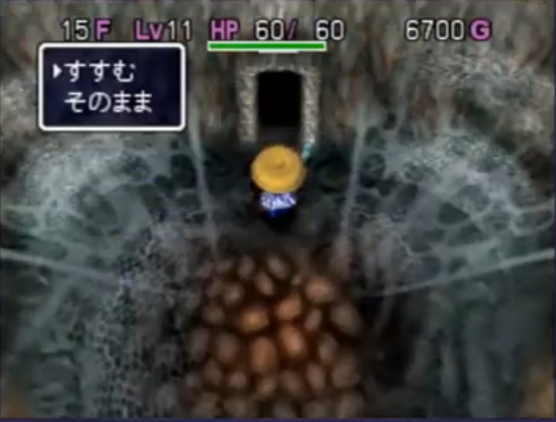
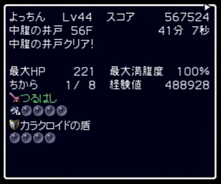
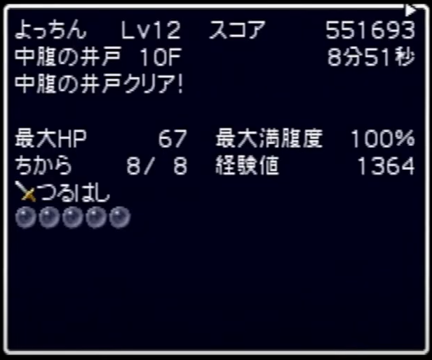
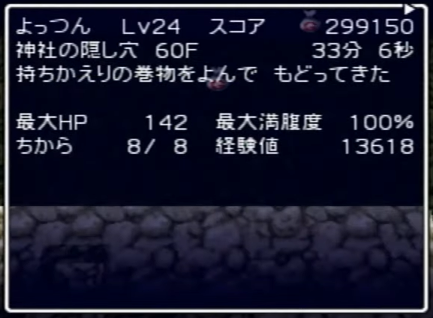
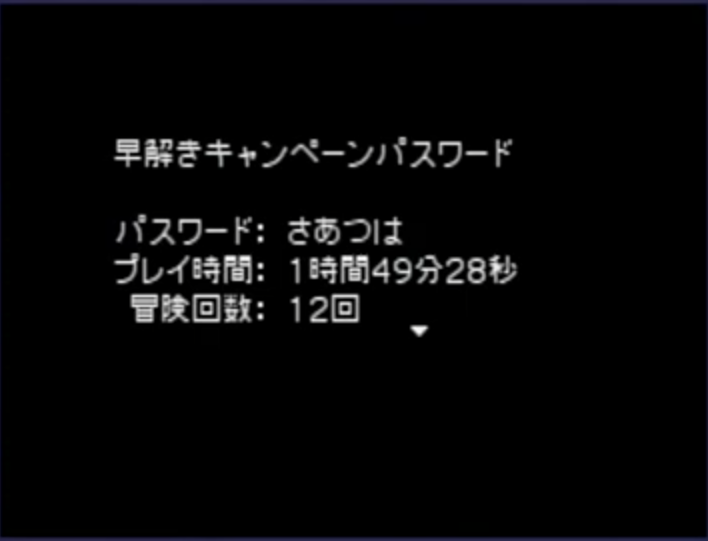
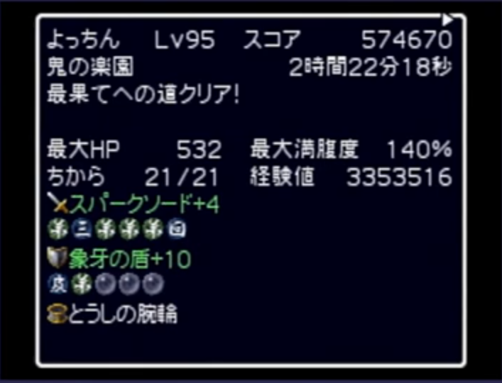

# 各種目のタイマー区間詳細

## シュテン山上級TA

### スタート

上級突入時に「はい」を選択した瞬間

### ストップ

女王グモの巣を抜けるときに「はい」を選択した瞬間

---

## カラクロTA

### スタート

中腹の井戸突入時に「はい」を選択した瞬間

### ストップ

カラクロイドの盾を装備し、罠師の腕輪を拾い、クリアリザルトが表示された瞬間

> ※カラクロイドの盾を装備していない場合は再走になるので注意！

---

## 中腹の井戸10FTA

### スタート

中腹の井戸突入時に「はい」を選択した瞬間

### ストップ

ワナ師の腕輪を拾い、クリアリザルトが表示された瞬間

---

## 女王グモ捕獲TA

### スタート

神社の隠し穴突入時に「はい」を選択した瞬間

### ストップ

女王グモの壺を所持した状態で持ち帰りを読み、クリアリザルトが表示された瞬間

> ※アイテム欄の確認ができないので女王グモの壺を拾ったか要チェック！

---

## ストーリーTA

### スタート

データ作成時に「これでよろしいですか？」で「はい」を選択した瞬間

### ストップ

エンドロール最後のクリアリザルトが表示された瞬間

---

## 最果てへの道99FTA

### スタート

最果てへの道突入時に「はい」を選択した瞬間

### ストップ

クリアリザルトが表示された瞬間

