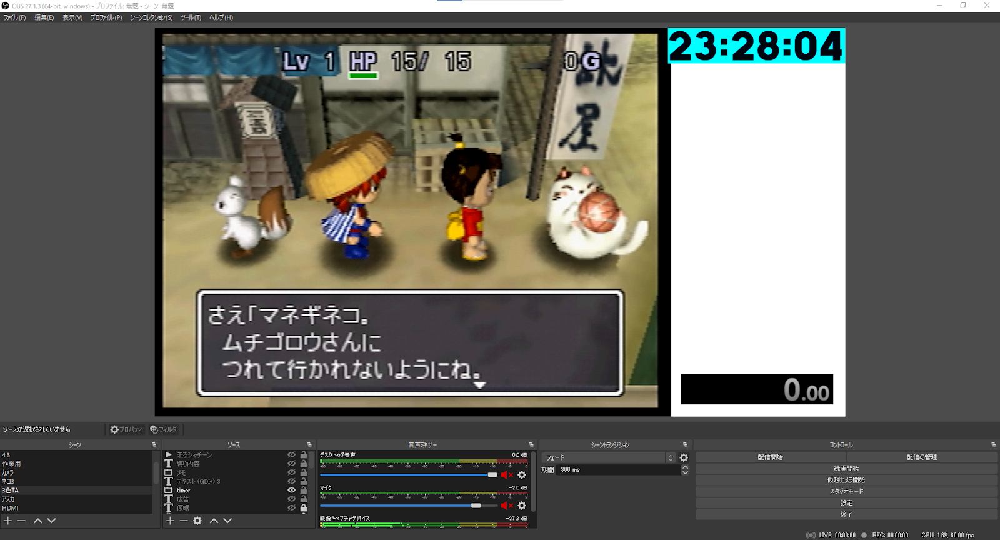
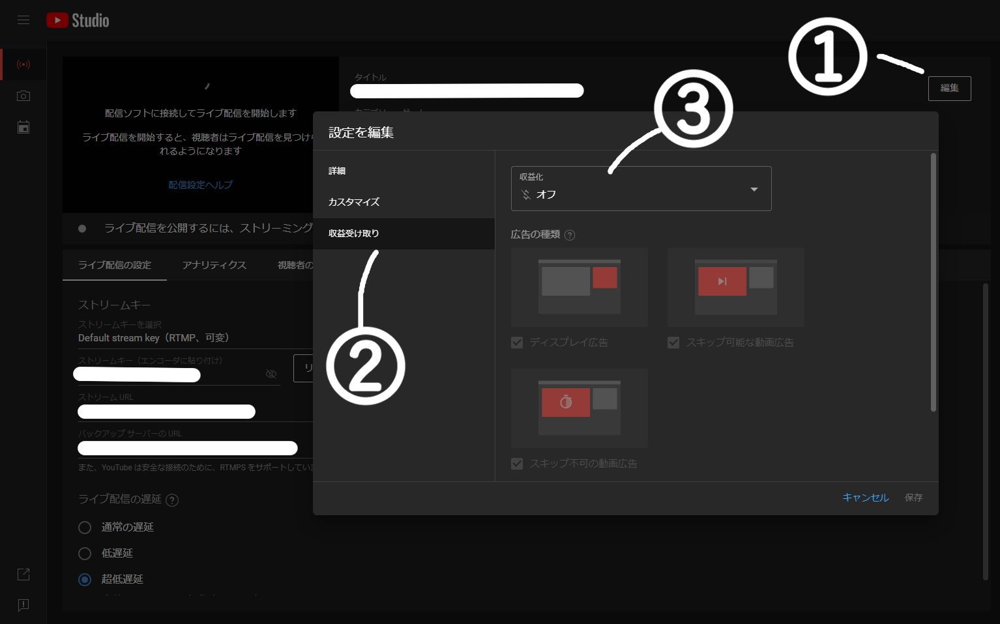
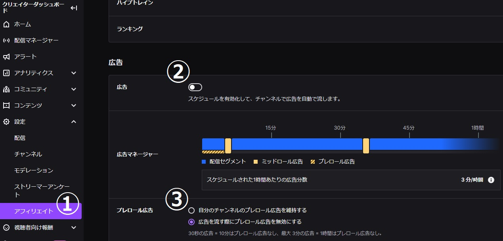

# 配信設定について

当日は[シレン2総合コミュ](https://www.youtube.com/@shiren2-soungou)のチャンネルでミラーを行います。  
本番配信時は以下の条件を必ず満たしての設定をお願いします。  

## 配信する際の情報

- ゲーム映像
- タイマー
- 現在の時刻

を取り込むこと

### タイマーについて

RTAのため、リザルト画面ではなく**実際の経過時間**で計測します。  
どのタイマーを使用しても構いません。  

> NOTE:  
> ※タイマー参考記事  
> [KAZAMITimer | RTAPlay!](https://rta-play.info/tools/stopwatch/kazamitimer/)

### 現在の時刻について

運営が**足切り時刻**を把握するために使用します。

> NOTE:  
> ※「現在の時刻」は以下のいずれかを使用してください。  
> [Time.is](https://time.is/ja/)  
> [JST Clock](https://www.nict.go.jp/JST/JST5.html)  
>  
> ※OBSで現在の時刻を入れる方法は以下を参考にしてください。  
> [OBSなどの配信画面に現在時刻を載せる簡単な方法 - Twitchメモ書き](https://twitch-memo.net/stream/streaming-time/)

### ゲーム映像

アスペクト比が**4:3**になっていること

## 音声について

ゲームの音声と自分の声以外の音声がOFFであること  
(マイクを使用しない場合はゲームの音声のみとすること)  

> NOTE:  
> Discordの「配信モード」を有効にして、「サウンドの無効化」を有効にすることをおすすめします。  
> ゲーム音声のみをOBSに取り込む方法としてこちらのプラグインも使いやすいのでご活用ください。  
> [【OBS】超簡単にゲーム音だけ（特定の音）を流したい？神プラグインがあります - 新・VIPで初心者がゲーム実況するには](https://vip-jikkyo.net/obs-win-capture-audio)

配信設定例

## 配信先の設定について

### YouTube Live

- 超低遅延にすること
- DVRを無効とすること
- 広告の設定をオフにすること

### Twitch

- 広告の設定をオフにすること

